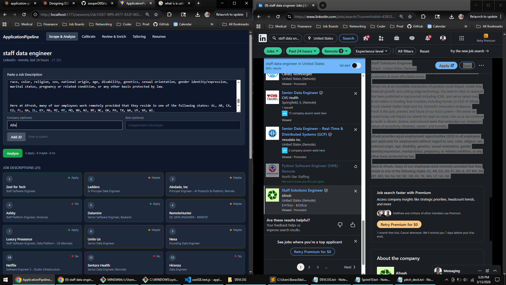
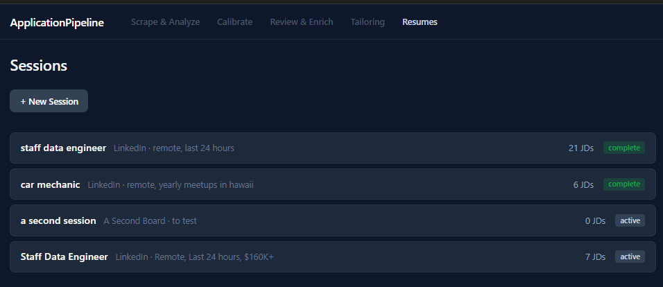
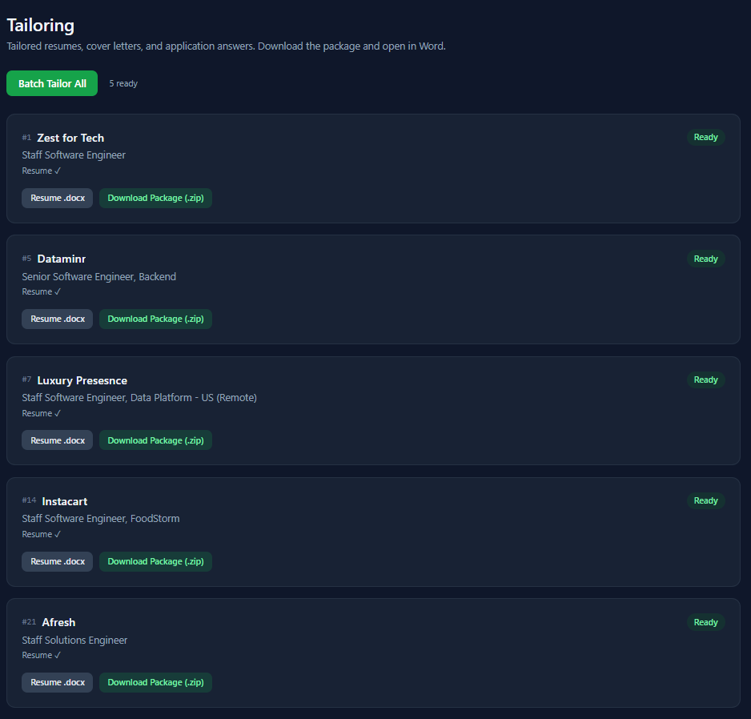

# ApplicationPipeline

**Job application orchestration for humans.**

Paste 25 job descriptions in 2 minutes — and receive an analysis of your skills vs the posted roles, individually and as a group, a ranking of which to "apply" to vs "maybe" or "no", plus tailored resumes and cover letters for the ones worth your time. The whole thing runs in the background in about 6 minutes. You can review the meta analysis and make a plan to sharpen your docs or skills while you wait.

## What It Does

You paste job descriptions. The platform analyzes them against your resume, recommends which ones are worth your time, and generates tailored resumes and cover letters for the winners — in parallel, while you go do something else.

Built around a real workflow that, as I developed it, lifted my own interview-callback rate from ~4% to ~11% during a live job search. Opinionated defaults, editable prompts, and funnel analytics that show you where to focus.



## How It Works — Two-Pass Matching

Most job-matching compares a résumé to a posting and scores overlap. That breaks
when the work is the same but the vocabulary isn't — a strong candidate gets
filtered out for describing the role in different words than the posting used.
Keyword matching and naive embedding similarity both fail here for the same
reason: they match *language*, not *work*.

So this matches against an expanded role, not the raw posting.

- **Pass 1 — expand the role.** The LLM infers the role's latent
  responsibilities: day-to-day work, pain points, stakeholder interactions, and
  technical demands the posting implies but never states. That inference is
  appended back into context, turning a thin JD into a fuller picture of the
  actual job.
- **Pass 2 — score against the expansion.** The system evaluates experience
  across multiple résumé variants against the *expanded* role. The output isn't a
  claim that you hold skills you don't — it's a measure of how well real
  experience maps once both sides are described in full, plus the specific
  re-emphasis that makes a real match legible to a human screener.

The result is reasoning, not just a number: what the role demands, where
experience already meets it, and the framing that surfaces the overlap. A score
can be gamed; a written-out mapping can be checked. Batch ~25 postings to surface
recurring skill gaps, adjacent role types, and market-level patterns across a
search session.

## The Funnel

```
LinkedIn filtered search (last 24h, etc)
 → paste ~25 JDs (2 min of copy-paste)
  → 6 Apply recommendations (AI analysis, ~5 min)
   → 6 tailored applications (background generation, ~2 min)
    → track → screen → interview
```



## Stack

| Layer | Tech |
|-------|------|
| Backend | FastAPI + SQLModel + Postgres (Railway) |
| Frontend | React (Vite) |
| LLM | Claude API (Anthropic) |
| Background Jobs | FastAPI BackgroundTasks → arq/Redis |
| Auth | Cookie-based anonymous sessions (Sprint 12) → magic link accounts |

## Status

🟢 **Phase 0 — Deployed**

Live at [application-pipeline-production.up.railway.app](https://application-pipeline-production.up.railway.app/). The core loop works end-to-end: paste JDs, kick off AI analysis, watch cards sort themselves green/yellow/red in real time, then kick off tailoring and download zip packages of tailored resumes, cover letters, and app answers. Cookie-based anonymous auth isolates data per browser — no login required. See [docs/implementation-plan.md](docs/implementation-plan.md) for the full roadmap.




### Output

Each zip package contains the JD analysis, the original job description, and a tailored resume — ready to open in Word and submit.


The tailoring isn't cosmetic. Each resume is restructured for the target role — different summaries, reordered skills, reframed bullet points.


## Quick Start

```bash
# Backend
cd backend
python -m venv venv
source venv/bin/activate
pip install -r requirements.txt
uvicorn app.main:app --reload

# Frontend
cd frontend
npm install
npm run dev
```

Requires a `.env` with `ANTHROPIC_API_KEY` and `DATABASE_PUBLIC_URL`.

## Docs

- [Implementation Plan](docs/implementation-plan.md) — phased build roadmap
- [Architecture](docs/architecture.md) — data model, API contracts, integration patterns
- [Workflow](docs/workflow.md) — the human method this automates
- [Decisions](docs/decisions.md) — architecture decision records
- [Service Layer Notes](docs/service-layer-notes.md) — implementation TODOs and design notes
- [Completed Sprints](docs/completed-sprints.md) — what shipped and when
- [Remaining Sprints](docs/remaining-sprints.md) — what's next (Phase 0)
- [Original Prompts](docs/original-prompts.md) — the manual Claude prompts this automates

## Repo Structure

> `[x]` = implemented and on disk. `[ ]` = planned — the file doesn't exist yet but its location is part of the design. This tree is both a map and a roadmap.

```
ApplicationPipeline/
├── README.md
├── Dockerfile                       # - [x] Multi-stage: node:20 builds React, python:3.12-slim runs backend + serves dist/
├── start.sh                         # - [x] alembic upgrade head → uvicorn (Railway injects PORT=8080)
├── dockerignore                     # - [x]
├── backend/
│   ├── tests/                       # - [x]  77/77 BE Tests Pass
│   │   ├── conftest.py
│   │   ├── test_resumes.py
│   │   ├── test_sessions.py
│   │   ├── test_tailoring.py
│   │   └── test_text_cleaning.py
│   └── pyproject.toml               # - [x] Python project manifest (replacing setup.[py|cfg])
│   ├── scripts/
│   │   ├── __init__.py
│   │   ├── seed.py                  # - [x] Seed 3 real resumes, 7 real JDs (test mod 5 batches)
│   ├── app/
│   │   ├── __init__.py
│   │   ├── main.py                  # - [x] FastAPI app, CORS, lifespan
│   │   ├── config.py                # - [x] settings, limits, model defaults
│   │   ├── database.py              # - [x] engine, session factory
│   │   ├── models.py                # - [x] SQLModel entities (7 tables)
│   │   ├── routers/
│   │   │   ├── __init__.py
│   │   │   ├── sessions.py          # - [x] session CRUD (POST, POST/jds, GET)
│   │   │   |                        # - [x] batch analyze SSE (POST /{id}/analyze)
│   │   │   |                        # - [x] batch-tailor (POST /{id}/batch-tailor)
│   │   │   ├── jds.py               # - [x] JD CRUD, status overrides, enrichment
│   │   │   |                        # - [x] single tailor, status, outputs, docx download
│   │   │   |                        # - [x] zip package download (ADR-014, Sprint 11)
│   │   │   ├── resumes.py           # - [x] paste, edit, list, delete (max 3)
│   │   │   └── activities.py        # - [ ] active list, add/complete, tracker view
│   │   ├── services/
│   │   │   ├── __init__.py
│   │   │   ├── claude.py            # - [x] API client, prompt assembly, response parsing
│   │   │   ├── analysis.py          # - [x] batch analysis (batches of 5, meta-summary)
│   │   │   ├── tailoring.py         # - [x] parallel tailoring (semaphore), docx handling
│   │   │   ├── docx_builder.py      # - [x] dumb renderer: Claude JSON → python-docx (ADR-011)
│   │   │   ├── activities.py        # - [ ] cascade templates, schedule_activities()
│   │   │   └── text_cleaning.py     # - [x] JD ingest pipeline (strip, normalize, collapse)
│   │   └── prompts/
│   │       ├── analysis.txt         # - [ ] system default: analysis phase
│   │       ├── resume_generation.txt # - [ ] system default: resume + docx formatting
│   │       └── cover_letter.txt     # - [ ] system default: cover letter + app answers
│   ├── alembic/
│   │   ├── env.py                   # - [x] 
│   │   └── versions/                # - [x] migration scripts
│   ├── alembic.ini                  # - [x] boilerplate
│   ├── requirements.txt
│   ├── .env.example                 # - [x] example
│   └── .env                         # - [x] ANTHROPIC_API_KEY, DATABASE_PUBLIC_URL
├── frontend/
│   ├── src/
│   │   ├── App.jsx                  # - [x] nav bar (ADR-015) + nested routes (react-router-dom v7)
│   │   ├── __tests__/               # 47/47 FE Tests Pass
│   │   │   ├── App.test.jsx            # - [x] shell/routing tests (all static)
│   │   │   ├── JDCard.test.jsx         # - [x] component test: card renders props, no API awareness
│   │   │   ├── ResumesPage.test.jsx    # - [x] resume CRUD flow, 3-resume cap UI, error states
│   │   │   ├── SessionDetailPage.test.jsx  # - [x] integration: session fetch, JD paste flow, card grid
│   │   │   ├── TailoringPage.test.jsx  # - [x] polling lifecycle, status transitions, output display, zip download
│   │   │   ├── useSSE.test.js          # - [x] parseSSEMessage, consume integration (fake readable stream)
│   │   │   ├── CardFan.test.jsx        # - [ ] fanned layout tests (once CardFan container exists)
│   │   ├── pages/
│   │   │   ├── CalibratePage.jsx       # - [x] stub (session-scoped)
│   │   │   ├── NotFoundPage.jsx        # - [x] 404 catch-all
│   │   │   ├── ResumesPage.jsx         # - [x] resume list + create/edit/delete (3-resume cap)
│   │   │   ├── ReviewPage.jsx          # - [x] stub (session-scoped)
│   │   │   ├── SessionDetailPage.jsx   # - [x] Tab 1: JD paste form + card grid
│   │   │   ├── SessionLayout.jsx       # - [x] useParams → fetch session → Outlet context
│   │   │   ├── SessionsPage.jsx        # - [x] session list + create form
│   │   │   ├── TailoringPage.jsx       # - [x] Tab 4: status polling, output viewer, zip download (Sprint 11)
│   │   ├── main.jsx                    # - [x] BrowserRouter entry point
│   │   ├── index.css                   # - [x] Tailwind v4 @import + @theme (custom pipeline-* palette)
│   │   ├── test-setup.js               # - [x] Vitest setup (jest-dom matchers)
│   │   ├── components/
│   │   │   ├── JDCard.jsx              # - [x] single JD card (number, company, role, status color)
│   │   │   ├── JDPasteForm.jsx         # - [x] text area + company/role fields, submit
│   │   │   ├── MetaAnalysis.jsx        # - [x] Tab 1: Claude's rolling summary panel
│   │   │   ├── ResumeCard.jsx          # - [x] label, preview, edit/delete buttons
│   │   │   ├── ResumeForm.jsx          # - [x] create + edit mode, text area + label
│   │   │   ├── SessionCreateForm.jsx   # - [x] board, filters, search_term
│   │   │   ├── CardFan.jsx             # - [ ] Tab 1: fanned card layout, color-coded sort
│   │   │   ├── TailoringStatus.jsx     # - [ ] Tab 4: extract from TailoringPage when complexity warrants
│   │   │   └── ActiveList.jsx          # - [ ] Active Applications: to-do by due date
│   │   ├── hooks/
│   │   │   └── useSSE.js               # - [x] SSE consumption for batch analysis
│   │   └── api/
│   │       └── client.js               # - [x] fetch wrappers for backend routes + zip download (Sprint 11)
│   ├── index.html                      # - [x] 
│   ├── vite.config.js                  # - [x] dev proxy (/api, /health → FastAPI), Vitest config
│   ├── eslint.config.js                # - [x]
│   └── package.json                    # - [x] React 19, Tailwind v4, Vitest
├── docs/
│   ├── architecture.md
│   ├── completed-sprints.md
│   ├── decisions.md
│   ├── implementation-plan.md
│   ├── original-prompts.md
│   ├── remaining-sprints.md
│   ├── service-layer-notes.md
│   └── workflow.md
└── LICENSE                          # BSL 1.1 → Apache 2.0 (2029-03-01)
```

## License

Licensed under the Business Source License 1.1 — see [LICENSE](LICENSE).
Converts to Apache 2.0 on 2029-03-01.
