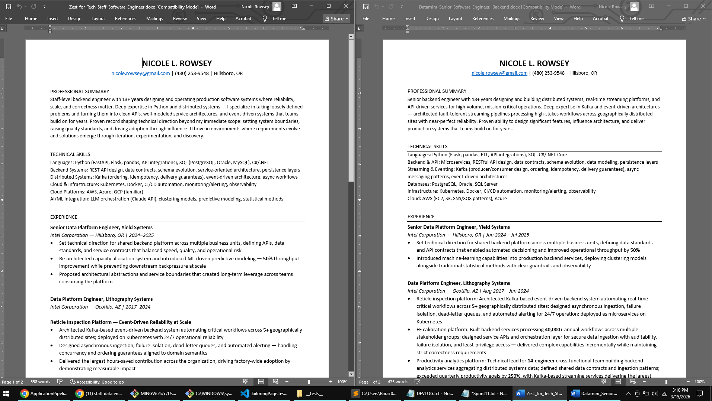

# ApplicationPipeline

**Job application orchestration for humans.**

Paste 25 job descriptions in 2 minutes — and receive an analysis of your skills vs the posted roles, individually and as a group, a ranking of which to "apply" to vs "maybe" or "no", plus tailored resumes and cover letters for the ones worth your time. The whole thing runs in the background in about 6 minutes. You can review the meta analysis and make a plan to sharpen your docs or skills while you wait.

## What It Does

You paste job descriptions. The platform analyzes them against your resume, recommends which ones are worth your time, and generates tailored resumes and cover letters for the winners — in parallel, while you go do something else.

Built around a real workflow that, as I developed it, lifted my own interview-callback rate from ~4% to ~11% during a live job search. Opinionated defaults, editable prompts, and funnel analytics that show you where to focus.


## How It Works — Two-Pass Matching

Most job-matching compares a résumé to a posting and scores overlap. That breaks
when the work is the same but the vocabulary isn't — a strong candidate gets
filtered out for describing the role in different words than the posting used.
Keyword matching and naive embedding similarity both fail here for the same
reason: they match *language*, not *work*.

So this matches against an expanded role, not the raw posting.

- **Pass 1 — expand the role.** The LLM infers the role's latent
  responsibilities: day-to-day work, pain points, stakeholder interactions, and
  technical demands the posting implies but never states. That inference is
  appended back into context, turning a thin JD into a fuller picture of the
  actual job.
- **Pass 2 — score against the expansion.** The system evaluates experience
  across multiple résumé variants against the *expanded* role. The output isn't a
  claim that you hold skills you don't — it's a measure of how well real
  experience maps once both sides are described in full, plus the specific
  re-emphasis that makes a real match legible to a human screener.

The result is reasoning, not just a number: what the role demands, where
experience already meets it, and the framing that surfaces the overlap. A score
can be gamed; a written-out mapping can be checked. Batch ~25 postings to surface
recurring skill gaps, adjacent role types, and market-level patterns across a
search session.

## The Funnel

```
LinkedIn filtered search (last 24h, etc)
 → paste ~25 JDs (2 min of copy-paste)
  → 6 Apply recommendations (AI analysis, ~5 min)
   → 6 tailored applications (background generation, ~2 min)
    → track → screen → interview
```


## Stack

| Layer | Tech |
|-------|------|
| Backend | FastAPI + SQLModel + Postgres (Railway) |
| Frontend | React (Vite) |
| LLM | Claude API (Anthropic) |
| Background Jobs | FastAPI BackgroundTasks → arq/Redis |
| Auth | Cookie-based anonymous sessions (Phase 0) → Google sign-in (Phase 1) |

## Status

🟢 **Phase 0 — Deployed**

Live at [application-pipeline-production.up.railway.app](https://application-pipeline-production.up.railway.app/). The core loop works end-to-end: paste JDs, kick off AI analysis, watch cards sort themselves green/yellow/red in real time, then kick off tailoring and download zip packages of tailored resumes, cover letters, and app answers. Cookie-based anonymous auth isolates data per browser — no login required. See [docs/implementation-plan.md](docs/implementation-plan.md) for the full roadmap.

Phase 1 is in progress — auth, billing, onboarding, and the tracking that makes the funnel visible. What ships and in what order: [docs/sprints/plan.md](docs/sprints/plan.md).


### Output

Each zip package contains the JD analysis, the original job description, and a tailored resume — ready to open in Word and submit.


The tailoring isn't cosmetic. Each resume is restructured for the target role — different summaries, reordered skills, reframed bullet points.



## Quick Start

Two terminals, both starting at the repo root.

```bash
# Backend
cd backend
python -m venv venv
source venv/bin/activate          # Windows: venv\Scripts\activate
pip install -r requirements.txt
uvicorn app.main:app --reload
```

```bash
# Frontend
cd frontend
npm install
npm run dev
```

Requires `backend/.env` with `ANTHROPIC_API_KEY` and `DATABASE_PUBLIC_URL` — copy
`backend/.env.example` and fill it in. Settings are read from the working directory, so start the
backend from `backend/`.

`backend/requirements.txt` is generated from `uv.lock` by `uv export`, so dependency changes
belong in `backend/pyproject.toml`, not in the txt file. The uv workflow replaces the venv and
pip steps above in the next leg of the dependency sprint — see
[docs/sprints/plan.md](docs/sprints/plan.md).

### Tests

```bash
cd backend && pytest       # 106 collected: 88 pass, 18 known failures in test_tailoring.py
cd frontend && npm test
```

Those 18 failures have one cause (session/DB wiring), predate the dependency sprint, and are
scheduled — see [docs/sprints/plan.md](docs/sprints/plan.md). Counts measured
2026-09-16.

### Checks

Before a local `docker build`, and after editing any `.gitignore` or `.dockerignore`:

```bash
python3 scripts/check_docker_context.py --probe   # every ignore rule, tested with fake files
python3 scripts/check_docker_context.py           # the files on your disk right now
```

It lists anything git ignores that Docker would still copy into the build. Needs Docker running; exit 0 means clean. Railway builds from GitHub, where ignored files don't exist, so this protects local builds.

Scripts in `scripts/` are stdlib-only on purpose — no virtualenv, so the check still runs when
the environment is the thing in doubt.

## Choosing the Model

One setting, one place: `default_model` in `backend/app/config.py` — `claude-opus-4-6` today.
Model choice is the main cost lever, since analysis is one conversation per session and
tailoring is one per Apply JD. [ADR-003](docs/decisions/adr-003-claude-opus-default-model.md) has the reasoning for Opus.

- **Change it without touching code**: set `DEFAULT_MODEL`. Pydantic-settings maps the field
  name to the env var, so `DEFAULT_MODEL=claude-sonnet-5` in `backend/.env` works locally, and
  the same variable in the Railway dashboard applies in production on restart.
- **Change it for one call**: `ClaudeConversation(model=...)` wins over the default.
- **See what ran**: `model_used` is stored on every tailoring job.

## Docs

- [Implementation Plan](docs/implementation-plan.md) — phased build roadmap
- [Architecture](docs/architecture.md) — data model, API contracts, integration patterns
- [Workflow](docs/workflow.md) — the human method this automates
- [Decisions](docs/decisions/) — architecture decision records, one file each
- [Sprint Plan](docs/sprints/plan.md) — the order, what is left, and what shipped when
- [Original Prompts](docs/original-prompts.md) — the manual Claude prompts this automates

## Repo Structure

A map of what exists. What's planned lives in [docs/sprints/plan.md](docs/sprints/plan.md).

```
backend/                FastAPI + SQLModel on Postgres
  app/routers/          the HTTP API: sessions (with SSE analysis and batch tailoring), JDs
                        (single tailoring, docx and zip downloads), resumes
  app/services/         Claude conversations, batched analysis, parallel tailoring, the docx
                        renderer (ADR-011), JD text cleaning
  app/models.py         seven tables: users, resumes, prompt templates, sessions, JDs,
                        tailoring jobs, activities
  alembic/              migrations, applied by start.sh on every deploy
  tests/                pytest
frontend/               React 19 + Vite + Tailwind v4 single-page app, Vitest in src/__tests__/
docs/                   architecture, implementation plan, decisions (ADRs), the sprint plan
                        and backlog, the workflow this automates and the prompts it grew from,
                        cost research, screenshots
scripts/                repo tooling that needs no virtualenv (see Checks above)
test-vehicles/          quarantine for anything that isn't source: spikes, reference code from
                        other projects, design notes, tester feedback, migration freezes.
                        Outside the Docker build
Dockerfile, start.sh    one Railway service: build the SPA, install the backend, run
                        migrations, serve both
```

## License

Licensed under the Business Source License 1.1 — see [LICENSE](LICENSE).
Converts to Apache 2.0 on 2029-03-01.
