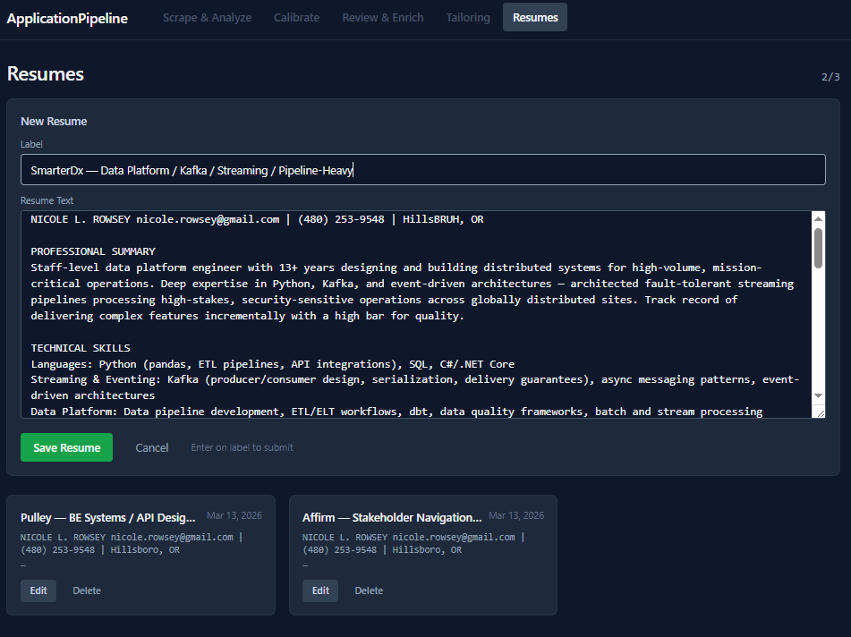
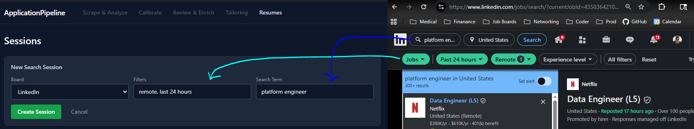
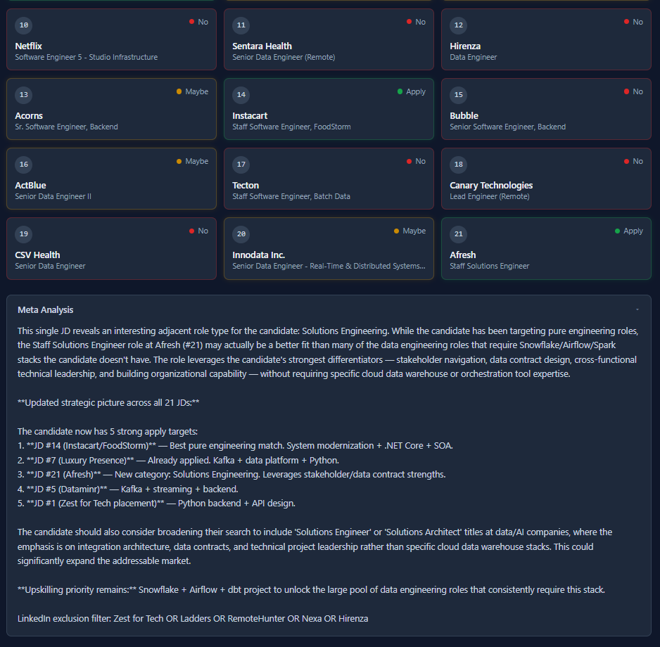
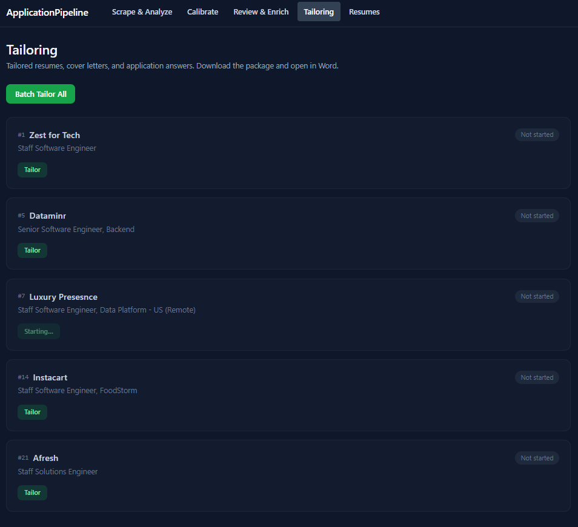
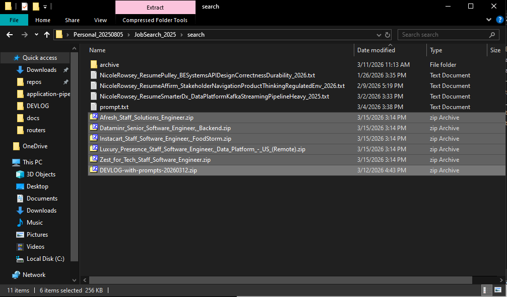
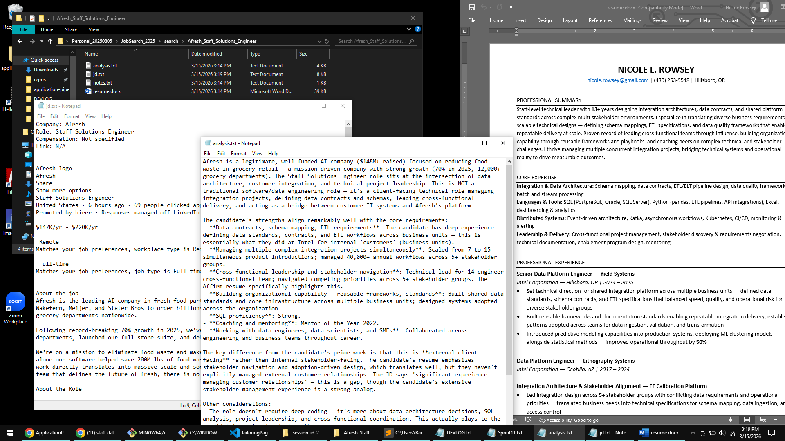

## What I sent
Email to 7 ex-Intel colleagues, friends, and family — walkthrough steps with the docs/img/ screenshots. See [Details](#details) below.

## Known limits of this round
- Asked testers to cap at ~10 sessions (API cost) — nothing was stress-tested
- Walkthrough skipped Calibrate and Review & Enrich entirely
- All recipients knew me; none arrived cold

## Who responded
Matt Small, Mark Rowsey, Greg Rowsey

---

## Details

from:	Nicole Rowsey <nicole.rowsey@gmail.com>
to:	
Greg Rowsey <rowseyg@gmail.com>,
Crawford Hampson <crawford.hampson@gmail.com>,
Mark Rowsey <mark.r.rowsey@gmail.com>,
David Rowsey <dmrowsey@gmail.com>,
"Khatri, Chandra M" <chandra.m.khatri@intel.com>,
Matthew Small <small.mw@gmail.com>,
Nicole Honesty <nrhonesty@gmail.com>
date:	Mar 15, 2026, 9:47 PM
subject:	Application Pipeline Application
mailed-by:	gmail.com

Are you swimming in hundreds of job descriptions?
Does it feel impossible to scrape enough good matches before your eyes blur over?
Are you burned out manually prompting chat boxes to "tailor my resume?"

Maybe it's time to relax and let **Application Pipeline Application** analyze, optimize, and batch tailor for you! Go to [application-pipeline-production.up.railway.app/sessions](https://application-pipeline-production.up.railway.app/sessions), add resumes, then paste in a bunch of LinkedIn job descriptions. It will
analyze each job against your resume(s)
mark them **Apply / Maybe / No**
explain why - for each job individually and overall as a set
Then, it will generate tailored resumes for your matches - all in 6 minutes. No really.

If you're job hunting and want to try my app, I'd love feedback before I release it to more people. Each session costs me real money in Claude API calls, so please do use and test it... but maybe not more than 10 sessions in a row before you let me know that you like it and want to use it that much ;)

Lmk what you think - would love to know if ppl get as much use and productivity gains out of it as I do.

Love and Huggles,
Nicole

1. Add Resume(s)

2. Click **ApplicationPipeline** and add a new session
- tag it with the filters and search terms you used for analytics later
- pro tip: use [LinkedIn regular search (not AI)](https://www.linkedin.com/search/results/all/) with minimal filters
- any job board or tag text is fine - you're scraping, not me

3. Paste JDs
- pro tip: if you click above the company icon in the LinkedIn right-hand window and then scroll down and shift-click at the bottom of the JD text, it will highlight that whole field *and it will remain highlighted as you click on different jobs in the left panel!!!* You can just alt+tab, click the next one down the line, and ctrl+c again

4. Click **Analyze** and receive
- an Apply/Maybe/No decision in 1 to 2 minutes per batch of 5 JDs
- a meta analysis for any through-line insights over the whole set

5. Navigate to Tailoring and hit Batch Tailor All
- or select just one or more at a time

6. Download your docx, or a zip of several files:

